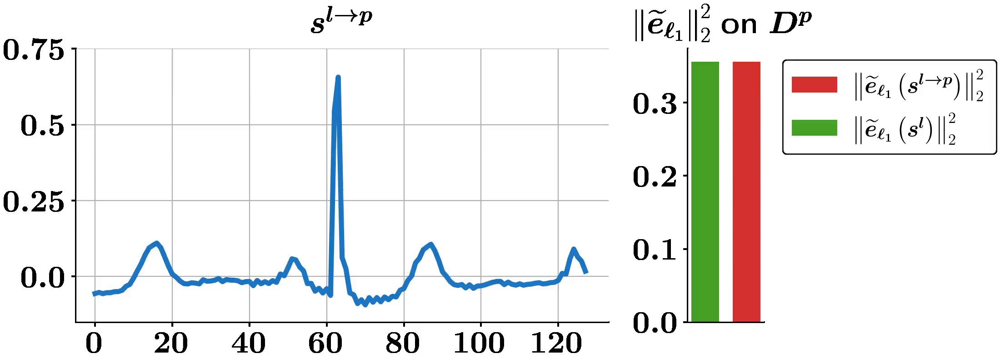

# A Personalized Zero-Shot ECG Arrhythmia Monitoring System

### 

## Results

| Method | Accuracy | Specificity | Precision | Recall | F1-Score |
| :--- | :---: | :---: | :---: | :---: | :---: |
| Kiranyaz *et al.*  | 0.959 | 0.971 | 0.842 | 0.888 | 0.864 |
| Zhai *et al.*  | 0.968 | 0.976 | 0.879 | 0.920 | 0.899 |
| Li *et al.* | 0.920 | 0.918 | 0.628 | 0.933 | 0.751 |
| Zhou *et al.*  | 0.979 | 0.989 | 0.908 | 0.897 | 0.902 |
| SAE-based  | 0.947 | 0.968 | 0.779 | 0.794 | 0.786 |
| NPE-based (ours)  | 0.947 | 0.968 | 0.779 | 0.794 | 0.786 |
| ABS  | 0.977 | **0.995** | **0.956** | 0.825 | 0.886 |
| Domain Adaptation (ours)  | 0.978 | 0.987 | 0.911 | 0.907 | 0.909 |
| Ensemble (ours)  | **0.982** | 0.988 | 0.919 | **0.937** | **0.928** |

 Personalized classifiers.  
 Zero-shot classifiers.

## Setup

Python (3.8.10) dependencies:

* matplotlib (3.4.2), numpy (1.19.5), scipy (1.6.3), pandas (1.2.4), seaborn (0.11.1, optional)
* torch (1.10.2+cu113)
* [wfdb](https://pypi.org/project/wfdb/) (3.3.0)
* [import_ipynb](https://pypi.org/project/import-ipynb/) (0.1.3)

To minimize conflict, our versions are given as reference.

## Replicating Our Results

1. Download the [MIT-BIH Arrhythmia Database](https://physionet.org/content/mitdb/1.0.0/).
2. Run ecg_beat_extraction.ipynb twice to generate single beats and beat-trios.
    - There should be 6 files generated.
3. Run ecg_dataset_preparation.ipynb twice to generate datasets from single beats and beat-trios.
    - This generates dictionaries for each user. Save the dictionaries for single beats (and optionally for beat-trios).
    - We perform domain adaptation at this stage using the generated dictionaries for each user.
    - There should be 68 dataset files generated, and dictionaries for each user.
4. To train your own classifier, go to train.ipynb. Otherwise, skip this part.
5. To test with pretrained weights go to pretrained_*.ipynb files.
